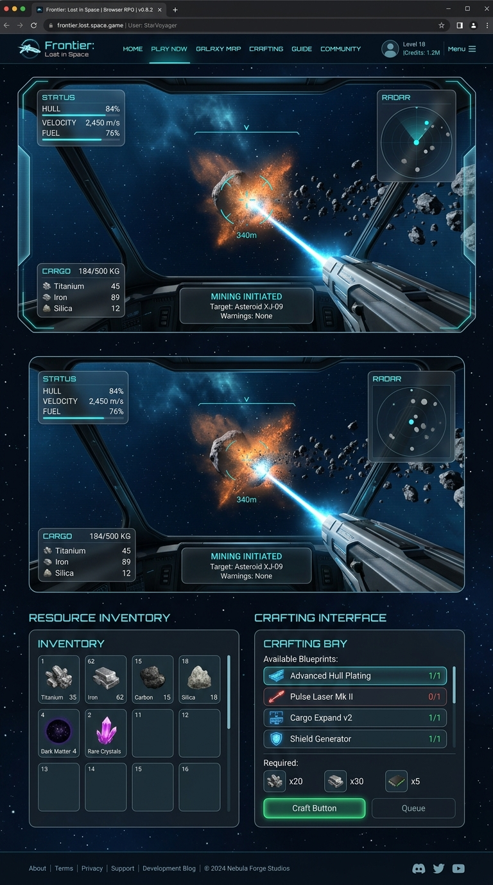

# Frontier: Orbital Combat

<p align="center">
  
</p>

A 3D browser-based space combat game. Defend Earth from waves of hostile forces while orbiting the planet, collecting resources, and upgrading your ship — built on React Three Fiber and deployed on the Internet Computer.

---

## Gameplay

1. **Survive** — Destroy enemy waves before they reach Earth
2. **Collect** — Gather resources from defeated enemies
3. **Upgrade** — Improve weapons, hull, and propulsion
4. **Advance** — Progress through the story phases narrated by A.E.G.I.S.

### Controls

| Input | Action |
|-------|--------|
| Mouse/Touch drag | Rotate orbital position |
| Click/Tap | Fire active weapon |
| `1` / `2` / `3` | Switch weapons |

### Weapons

| Weapon | Damage | Fire Rate | Description |
|--------|--------|-----------|-------------|
| Pulse | 15 | Fast | Rapid-fire energy rounds |
| Rail | 80 | Slow | High-velocity slug |
| Missile | 120 | Medium | Homing warhead |
<div align="center">


---

# FRONTIER: LOST IN SPACE

### *An AI-Companion Space Survival Experience*

[](https://github.com/KudbeeZero/frontier)
[](https://github.com/KudbeeZero/frontier/blob/main/docs/DEVELOPMENT_PHASES.md)
[](https://github.com/KudbeeZero/frontier)
[](./LICENSE)
[](https://react.dev)
[](https://threejs.org)
[](https://typescriptlang.org)

</div>

---

## Our Mission

> *"Space is not the final frontier — survival is."*

**Frontier: Lost in Space** is built on a singular belief: that the most compelling games are ones where your choices matter, your resources are finite, and your companion is more than just an NPC.

We are building a narrative-driven 3D space survival game where players pilot a damaged spacecraft through a hostile asteroid field, guided — and sometimes challenged — by **A.E.G.I.S.**, an advanced AI companion whose trust you must earn through every decision you make.

This is not just a game. It is an exploration of the relationship between human intuition and artificial intelligence in the most unforgiving environment imaginable: deep space, alone, with no guarantee of rescue.

We believe interactive storytelling and emergent gameplay belong together. We believe the browser is a legitimate platform for world-class 3D experiences. And we believe the future of games lives on decentralized, player-owned infrastructure.

**That is what we are building.**

---

## What Is Frontier?

Frontier is a **3D browser-based space survival and combat game** with:

- A rich **narrative engine** powered by the A.E.G.I.S. AI companion
- **Real-time 3D flight** in a procedurally generated asteroid field
- A deep **resource mining, inventory, and crafting** system
- **Meaningful player choices** that affect your ship, your story, and your relationship with A.E.G.I.S.
- A **six-phase story arc** that escalates from survival to galactic confrontation
- A future **on-chain persistence layer** via the Internet Computer Protocol (ICP)

---

## Core Gameplay Loop

```
EXPLORE ──► MINE ──► CRAFT ──► UPGRADE ──► SURVIVE ──► ADVANCE
   ▲                                                        │
   └────────────────────────────────────────────────────────┘
```

Every loop deepens your ship's capabilities and your bond — or conflict — with A.E.G.I.S.

---

## Tech Stack

- **React 19** + **TypeScript**
- **Three.js** + **React Three Fiber** + **@react-three/drei**
- **Zustand** — game state management
- **TailwindCSS** — HUD styling
- **Vite** — build tooling
- **Motoko / ICP** — on-chain backend (Phase 6)
| Layer | Technology | Purpose |
|---|---|---|
| **UI Framework** | React 19 + TypeScript 5.8 | Component architecture |
| **3D Engine** | Three.js 0.176 + React Three Fiber | Scene rendering |
| **3D Helpers** | @react-three/drei, @react-three/cannon | Abstractions & physics |
| **State** | Zustand 5.0 | Global game state (11 stores) |
| **Styling** | Tailwind CSS 3.4 + Radix UI | Design system |
| **Build** | Vite 5.4 + pnpm | Bundling & dev server |
| **Code Quality** | Biome + TypeScript strict | Linting & type safety |
| **Backend (Phase 6)** | Motoko on ICP (DFINITY) | On-chain game state |
| **Auth (Phase 6)** | Internet Identity | Decentralized login |
| **Voice** | Web Speech API | A.E.G.I.S. narration |

---

## Project Architecture

```
frontier/
├── src/
│   └── frontend/                 # React + Vite application
│       └── src/
│           ├── components/
│           │   ├── Game/         # Three.js canvas & scene
│           │   ├── Ship/         # Ship controller & mining laser
│           │   ├── Environment/  # Asteroids, stations, derelicts, stars
│           │   ├── UI/           # HUD, radar, status, notifications
│           │   ├── Story/        # Narrative event panels
│           │   ├── Inventory/    # Resource & component UI
│           │   ├── Crafting/     # Recipe browser & crafting UI
│           │   └── Controls/     # Mobile touch controls
│           ├── stores/           # 11 Zustand state stores
│           ├── systems/          # Pure game logic (combat, orbital, targeting)
│           ├── config/           # Weapons, enemies, constants
│           ├── utils/            # Physics, generation, voice, storage
│           ├── hooks/            # ICP auth, mobile detection
│           └── types/            # Shared TypeScript interfaces
├── docs/                         # Architecture, game design, phases
├── story-data/                   # Chapter templates & narrative content
└── scripts/                      # Build & deployment utilities
```

---

## Current Features

### ✅ Implemented

| System | Status | Details |
|---|---|---|
| **3D Ship Flight** | Complete | WASD + mouse pointer-lock, physics-based momentum |
| **Asteroid Field** | Complete | 80 instanced asteroids, procedural generation (seeded) |
| **Mining System** | Complete | Raycast targeting, 3s extraction, depletion tracking |
| **9 Resource Types** | Complete | Iron, Silicon, Carbon, Titanium, Platinum, Rare Earth, Exotic Matter, Dark Matter, Quantum Crystals |
| **Inventory System** | Complete | Weight-based cargo (500kg cap), resource grid UI |
| **Crafting System** | Complete | 9 recipes across Hull, Engine, Weapons, Utility tiers |
| **HUD Overlay** | Complete | Fuel, hull, oxygen, power gauges + radar minimap |
| **Story Engine** | Complete | Event-driven narrative with branching choices |
| **A.E.G.I.S. Companion** | Partial | 7 Phase 1 events, voice narration via Web Speech API |
| **Save / Load** | Complete | Auto-save every 30s to localStorage |
| **Mobile Support** | Complete | Virtual joystick, touch camera, haptics |
| **Space Station POIs** | Complete | 3 fixed locations, docking placeholder |
| **Derelict Ships** | Complete | Discoverable salvage locations |
| **Notification System** | Complete | Toast queue with 4s display |
| **Pause / Menu** | Complete | Full pause state, settings persistence |

### 🔧 In Progress

| System | Status | Details |
|---|---|---|
| **Enemy Spawn System** | In Progress | Store scaffolded, AI behavior pending |
| **Combat System** | In Progress | Targeting system built, wave logic pending |
| **Weapon Integration** | In Progress | Config defined, firing mechanics pending |
| **Phase 1 Completion** | In Progress | Enemy waves + resource drops needed |

### 📋 Planned

| System | Phase | Details |
|---|---|---|
| **Full Weapon Unlock Sequence** | Phase 2 | Pulse, Rail, Missile systems |
| **Enemy Wave Escalation** | Phases 2–4 | Scout → Cruiser → Dreadnought → Drone Swarm |
| **Upgrade Shop** | Phase 2 | Credits-based between-wave purchasing |
| **Earth Health Mechanic** | Phase 4 | Planetary defense stakes |
| **Mothership Boss** | Phase 5 | Multi-stage boss encounter |
| **On-Chain Persistence** | Phase 6 | ICP Motoko canister for game state |
| **Leaderboard** | Phase 6 | On-chain score submission |
| **Multiple Endings** | Phase 6 | A.E.G.I.S. trust-based narrative conclusions |

---

## Development Roadmap

```
PHASE 1 ████████░░░░  75%   Survival      — Core mechanics, story, A.E.G.I.S.
PHASE 2 ░░░░░░░░░░░░   0%   Stabilization — Full weapons, upgrades, mixed waves
PHASE 3 ░░░░░░░░░░░░   0%   Discovery     — Intel system, recon, forward base
PHASE 4 ░░░░░░░░░░░░   0%   Escalation    — Dreadnoughts, drones, Earth health
PHASE 5 ░░░░░░░░░░░░   0%   Breakthrough  — Mothership boss, special abilities
PHASE 6 ░░░░░░░░░░░░   0%   Resolution    — On-chain state, endings, leaderboard
```

### Phase 1 Remaining Tasks

- [ ] Enemy spawning system (Scout class AI behavior)
- [ ] Wave progression logic (milestone-triggered)
- [ ] Resource drops from destroyed enemies
- [ ] Remaining A.E.G.I.S. dialogue events (oxygen warning, hull breach, first threat)
- [ ] Full Phase 1 story playthrough testing

---

## Game Systems Deep Dive

### A.E.G.I.S. — Adaptive Emergency Guardian Intelligence System

A.E.G.I.S. is not a passive narrator. It is a reactive AI companion that:

- Monitors your ship systems in real time
- Delivers voiced dialogue through the Web Speech API
- Presents **player choices** with tangible mechanical consequences (fuel cost, hull damage, oxygen impact)
- Builds a **trust relationship** with the player over all six phases
- Unlocks different narrative paths and endings based on accumulated trust

### Resource Economy

| Resource | Rarity | Weight | Primary Use |
|---|---|---|---|
| Iron | Common | 5 kg | Hull plating, basic structures |
| Silicon | Common | 3 kg | Electronics, shields |
| Carbon | Common | 2 kg | Composite materials |
| Titanium | Uncommon | 8 kg | Advanced hull, engines |
| Platinum | Uncommon | 15 kg | High-tier weapon components |
| Rare Earth | Uncommon | 6 kg | Advanced systems |
| Exotic Matter | Rare | 1 kg | Experimental upgrades |
| Dark Matter | Rare | 0.5 kg | Cutting-edge tech |
| Quantum Crystals | Rare | 2 kg | Top-tier crafting |

### Crafting Recipes (Phase 1)

| Component | Resources Required | Benefit |
|---|---|---|
| Reinforced Hull Plating | 20 Iron + 10 Carbon | +25 max hull |
| Ion Drive Engine | 20 Titanium + 5 Rare Earth + 10 Silicon | +20 speed, +50 fuel |
| Quantum Drill | 2 Quantum Crystals + 10 Titanium + 5 Platinum | +40 mining power |
| Shield Generator | 15 Silicon + 8 Rare Earth | Shield protection |
| Fuel Cell Array | 25 Carbon + 10 Silicon | +100 max fuel |
| *...and 4 more* | — | — |

---

## Getting Started

```bash
# Install dependencies
pnpm install

# Start dev server
pnpm dev

# Build for production
pnpm build
```

---

## Project Structure

```
src/
├── frontend/
│   └── src/
│       ├── components/
│       │   ├── game/   # Three.js / R3F scene components
│       │   └── ui/     # HUD and 2D overlay components
│       ├── stores/     # Zustand state (ship, game, weapons, enemy)
│       ├── systems/    # Pure game logic
│       ├── config/     # Static game data (enemies, weapons)
│       └── types/      # Shared TypeScript interfaces
└── backend/            # ICP Motoko canister (Phase 6)
```

---

## Current Status (Phase 1 — Survival)

- [x] Earth globe with orbital camera
- [x] Star field background
- [x] HUD overlay (Status, Radar, Weapon Console)
- [x] Zustand stores wired up
- [x] Story event system with A.E.G.I.S. narrator
- [x] Mobile touch controls
- [ ] Enemy spawn system
- [ ] Weapon firing mechanics
- [ ] Collision detection
- [ ] Resource pickup + wave progression

See [`docs/DEVELOPMENT_PHASES.md`](docs/DEVELOPMENT_PHASES.md) for the full roadmap.
### Prerequisites

- **Node.js** >= 16.0.0 (22.x recommended)
- **pnpm** >= 7.0.0

```bash
# Install pnpm if needed
npm install -g pnpm
```

### Installation

```bash
# Clone the repository
git clone https://github.com/KudbeeZero/frontier.git
cd frontier

# Install dependencies
pnpm install

# Start the development server
cd src/frontend
pnpm dev
```

Open [http://localhost:5173](http://localhost:5173) in your browser.

### Available Scripts

```bash
pnpm dev          # Start Vite dev server with HMR
pnpm build        # Production build
pnpm preview      # Preview production build locally
pnpm typecheck    # TypeScript strict type checking
pnpm check        # Biome linting analysis
pnpm fix          # Biome auto-fix
```

### Controls

| Input | Action |
|---|---|
| `W A S D` | Thrust forward / strafe / reverse |
| `Mouse` (pointer lock) | Rotate camera / aim |
| `Left Click` | Mine targeted asteroid / fire weapon |
| `Shift` | Boost (2.5× speed multiplier) |
| `I` | Toggle inventory panel |
| `C` | Toggle crafting panel |
| `TAB` | Toggle HUD visibility |
| `ESC` | Release pointer lock / pause |
| `1 / 2 / 3` | Switch active weapon |

---

## Why This Matters

The games industry is at an inflection point.

Browser-based 3D has reached a threshold where experiences once reserved for native clients are now deliverable instantly, without installation, on any device. At the same time, AI companions have evolved beyond scripted dialogues into systems capable of meaningful, reactive relationships.

**Frontier sits at the intersection of these two shifts.**

We are proving that:

1. **High-fidelity 3D games belong in the browser** — powered by Three.js and React Three Fiber, Frontier delivers a console-quality feel through a URL.

2. **AI companions can be narrative protagonists** — A.E.G.I.S. is not a chatbot layered onto a game. It is a core game mechanic. Your relationship with it changes the story.

3. **Game state belongs to players** — Phase 6 moves persistence on-chain via ICP. No server shutdowns. No lost progress. No corporate control over your game history.

4. **Great games can be built collaboratively with AI** — Frontier is itself a demonstration that AI-assisted development (Claude for design and narrative, Caffeine AI for implementation) can produce a coherent, ambitious product.

---

## Contributing

Frontier is actively developed. If you are interested in contributing:

1. Fork the repository
2. Create a feature branch: `git checkout -b feature/your-feature-name`
3. Commit your changes with clear, descriptive messages
4. Open a pull request against `main`

Please read [`CLAUDE_CAFFEINE_WORKFLOW.md`](./CLAUDE_CAFFEINE_WORKFLOW.md) for our current team development process.

For narrative and story contributions, see [`story-data/README.md`](./story-data/README.md).

---

## Documentation

| Document | Description |
|---|---|
| [`docs/ARCHITECTURE.md`](./docs/ARCHITECTURE.md) | System architecture and data flow |
| [`docs/GAME_DESIGN.md`](./docs/GAME_DESIGN.md) | Core game mechanics and design decisions |
| [`docs/DEVELOPMENT_PHASES.md`](./docs/DEVELOPMENT_PHASES.md) | Full six-phase narrative and gameplay roadmap |
| [`story-data/README.md`](./story-data/README.md) | Story data system and chapter contribution guide |
| [`CLAUDE_PROJECT_INSTRUCTIONS.md`](./CLAUDE_PROJECT_INSTRUCTIONS.md) | Claude AI role and responsibilities |
| [`CLAUDE_CAFFEINE_WORKFLOW.md`](./CLAUDE_CAFFEINE_WORKFLOW.md) | Team collaboration and handoff protocol |

---

## License

[MIT](LICENSE)
This project is licensed under the **MIT License** — see the [`LICENSE`](./LICENSE) file for details.

---

<div align="center">

---

**FRONTIER: LOST IN SPACE**

*Built with purpose. Designed for survival. Engineered for the future.*

[GitHub](https://github.com/KudbeeZero/frontier) · [Report an Issue](https://github.com/KudbeeZero/frontier/issues) · [Docs](./docs)

---

*© 2026 KudbeeZero. All rights reserved.*
*Made with React · Three.js · TypeScript · and a deep belief that space is worth exploring.*

</div>
